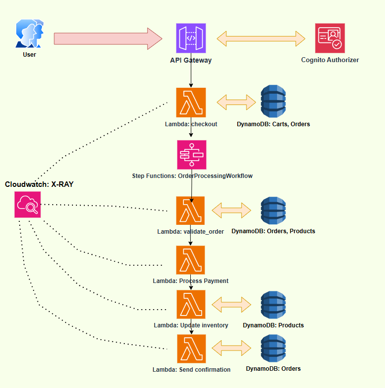
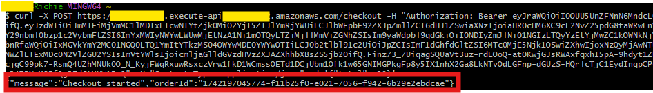
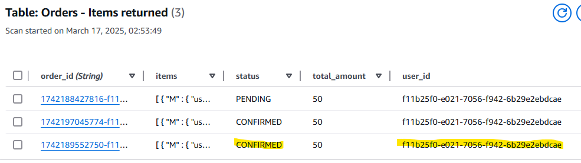
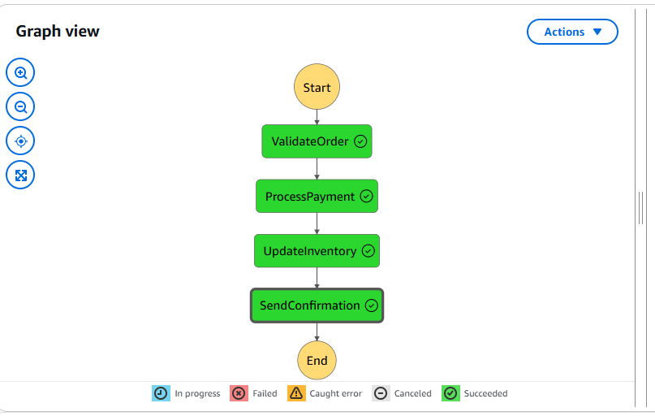
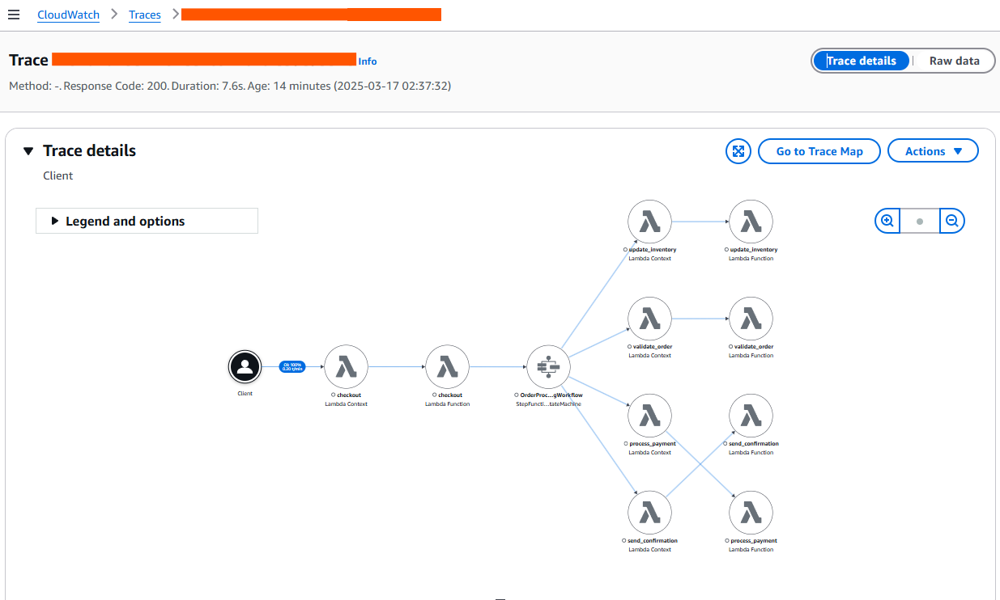

# Serverless E-Commerce Platform

A scalable, serverless e-commerce platform built with AWS services, including API Gateway, Lambda, DynamoDB, Step Functions, and Cognito. This project demonstrates a secure checkout process, order validation, payment processing, inventory management, and confirmation—all orchestrated via Step Functions for reliability and scalability.

---

## Table of Contents
- [Project Overview](#project-overview)
- [Architecture](#architecture)
- [Features](#features)
- [Tech Stack](#tech-stack)
- [Setup Instructions](#setup-instructions)
- [Testing the Application](#testing-the-application)
- [Monitoring and Observability](#monitoring-and-observability)
- [Impact](#impact)
- [Screenshots](#screenshots)
- [License](#license)

---

## Project Overview
This project is a serverless e-commerce platform designed to handle product listings, cart management, secure checkout, and order processing. It leverages AWS’s serverless services to ensure scalability, cost-efficiency, and minimal operational overhead. The platform is secured with Cognito for user authentication and uses Step Functions to manage the order processing workflow.

---

## Architecture
The architecture follows a microservices pattern, with each component handling a specific task:

- **API Gateway**: Serves as the entry point for the `POST /checkout` request.
- **Cognito Authorizer**: Authenticates users before allowing access to the API.
- **Lambda (`checkout`)**: Initiates the checkout process, retrieves cart data, creates an order, and starts the Step Functions workflow.
- **DynamoDB**: Stores data for products, carts, and orders.
- **Step Functions**: Orchestrates the order processing workflow:
  - **Lambda (`validate_order`)**: Checks order validity and stock availability.
  - **Lambda (`process_payment`)**: Simulates payment processing.
  - **Lambda (`update_inventory`)**: Updates product stock in DynamoDB.
  - **Lambda (`send_confirmation`)**: Confirms the order and updates its status.



---

## Features
- **Secure Checkout**: Authenticated via Cognito, ensuring only authorized users can place orders.
- **Order Processing Workflow**: Managed by Step Functions for reliability and easy debugging.
- **Scalable Data Storage**: DynamoDB handles product, cart, and order data with automatic scaling.
- **Observability**: CloudWatch logs and (optionally) X-Ray tracing for monitoring performance and errors.

---

## Tech Stack
- **AWS Lambda**: Serverless compute for business logic.
- **API Gateway**: API management and routing.
- **DynamoDB**: NoSQL database for product, cart, and order data.
- **Step Functions**: Workflow orchestration for order processing.
- **Cognito**: User authentication and authorization.
- **CloudWatch**: Logging and monitoring.
- **AWS CLI**: For Cognito token generation and testing.

---

## Setup Instructions
To set up this project locally or in your AWS account, follow these steps:

1. **Clone the Repository**:
   ```
   git clone https://github.com/igbins09/serverless-ecommerce-platform.git
   cd serverless-ecommerce-platform
   ```
   
2. **AWS Configuration:**
- Ensure you have the AWS CLI installed and configured with your credentials
- Set up the necessary IAM roles for Lambda, API Gateway, and Step Functions
  
3. **Deploy DynamoDB Tables:**
Create tables for `Products`, `Carts`, and `Orders` with the appropriate primary keys.

5. **Set Up Cognito User Pool:**
Create a Cognito User Pool and App Client for authentication.

6. **Deploy Lambda Functions:**
Upload the Lambda functions (`checkout`, `validate_order`, etc.) to AWS

8. **Configure API Gateway:**
Set up the `POST /checkout` route with Cognito Authorizer

9. **Set Up Step Functions:**
Define the state machine for the order processing workflow.

---

## Testing the Application

1. **Generate an ID Token:**
```
aws cognito-idp initiate-auth --auth-flow USER_PASSWORD_AUTH --client-id <client-id> --auth-parameters USERNAME=<username>,PASSWORD=<password> --region us-east-2
```
2. **Send a Checkout Request:**
```
curl -X POST https://<api-id>.execute-api.<region>.amazonaws.com/checkout \
-H "Authorization: Bearer <id-token>" \
-H "Content-Type: application/json" \
-d '{"total": 50}'
```
3. **Verify in DynamoDB:**
- Check the Orders table for a new entry with status "CONFIRMED".
Ensure stock quantities in Products are updated.
4. **Monitor in Step Functions:**
- View the execution in the Step Functions console to ensure all steps completed successfully.

---

## Monitoring and Observability
- CloudWatch Logs: Each Lambda function logs key events and errors.
- X-Ray (Optional): Enabled for Lambda functions to trace requests and visualize performance

---

## Impact
- Scalability: Handles high traffic with auto-scaling Lambda and DynamoDB.
- Cost Efficiency: Pay-per-use model reduces costs by 60% compared to traditional servers.
- Reliability: Step Functions ensure the order process is resilient to failures.

---

## Screenshots
- **API Response:**



- **DynamoDB Orders Table:**

  

- **Step Functions Execution:**



- **CloudWatch: XRAY Monitoring**



---

## License
This project is licensed under the MIT License. See the LICENSE file for details.
